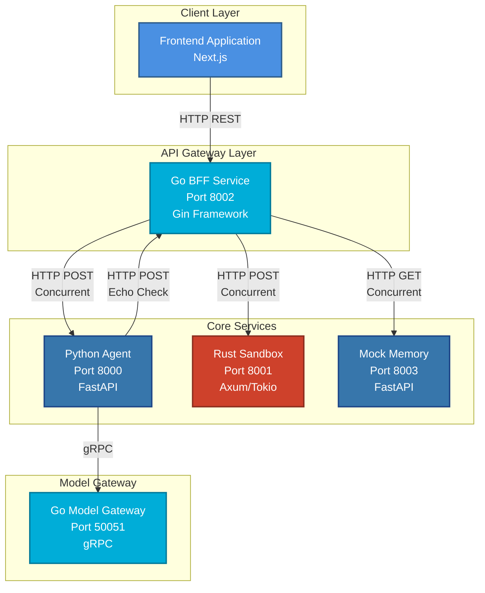
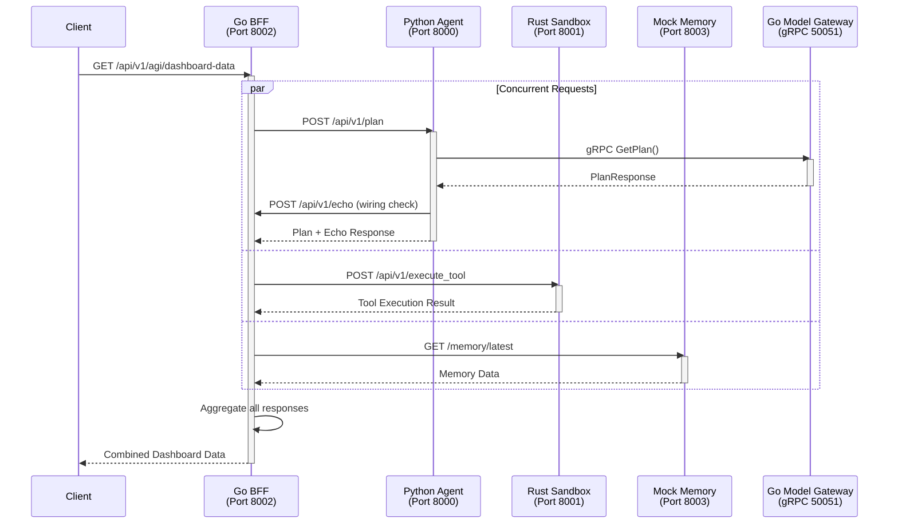
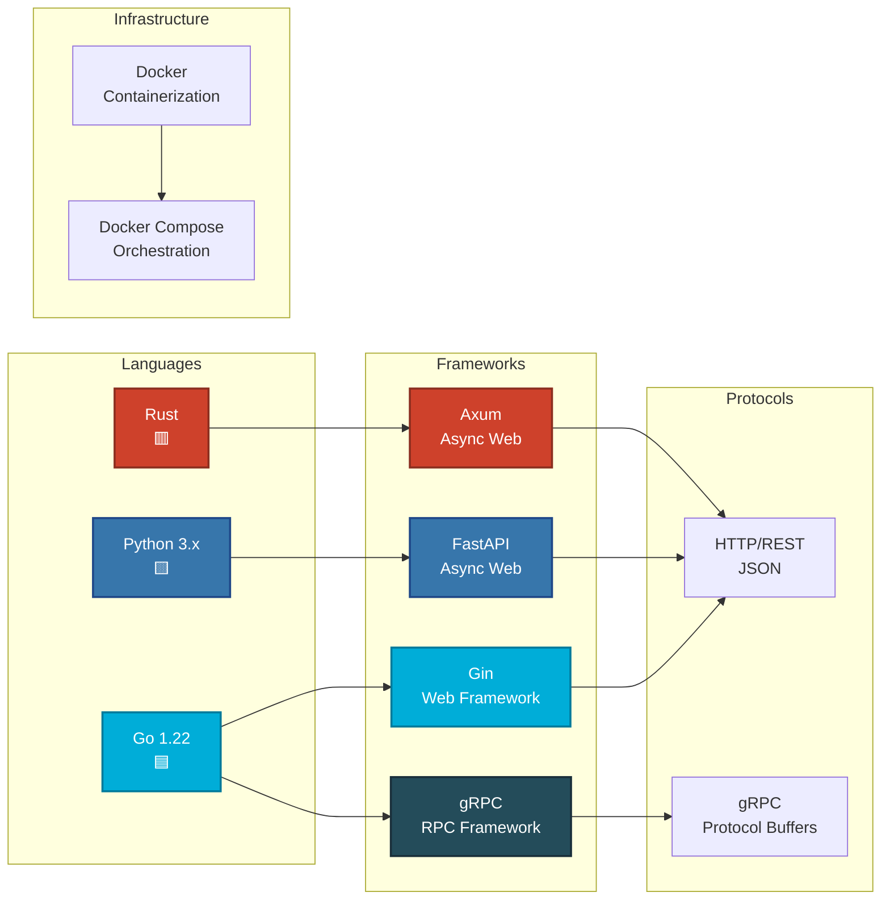
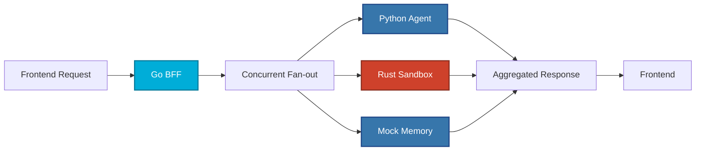
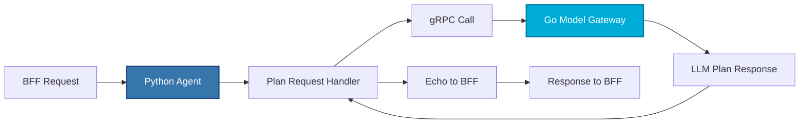
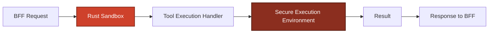
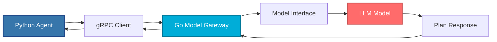

# 🚀 Polygon AGI Backend - Comprehensive Guide

> **A polyglot microservices architecture** designed for fast iteration on an "agent + tools + gateway + BFF" backend system.

---

## 📋 Table of Contents

1. [Overview](#overview)
2. [Architecture Diagram](#architecture-diagram)
3. [Services Overview](#services-overview)
4. [Request Flow](#request-flow)
5. [Technology Stack](#technology-stack)
6. [Getting Started](#getting-started)
7. [Service Details](#service-details)
8. [API Endpoints](#api-endpoints)
9. [Development Guide](#development-guide)
10. [Troubleshooting](#troubleshooting)

---

## 🎯 Overview

This backend system is built using **multiple programming languages** (polyglot architecture) to leverage the strengths of each language:

- **Go** for high-performance API gateways and BFF (Backend for Frontend)
- **Python** for AI/ML agent logic and rapid prototyping
- **Rust** for secure, sandboxed tool execution
- **gRPC** for efficient inter-service communication

The system follows a **microservices architecture** where each service has a specific responsibility and communicates with others through well-defined APIs.

---

## 🏗️ Architecture Diagram



**Legend:**
- 🔵 **Blue**: Go services (high performance)
- 🟦 **Dark Blue**: Python services (AI/ML logic)
- 🔴 **Red**: Rust service (secure execution)

---

## 📦 Services Overview

| Service | Language | Framework | Port | Purpose | Status |
|---------|----------|-----------|------|---------|--------|
| **Go BFF** | Go | Gin | 8002 | Backend for Frontend - aggregates data from all services | ✅ Active |
| **Python Agent** | Python | FastAPI | 8000 | Agent planning & orchestration, calls model gateway | ✅ Active |
| **Rust Sandbox** | Rust | Axum/Tokio | 8001 | Secure tool execution environment | ✅ Active |
| **Go Model Gateway** | Go | gRPC | 50051 | LLM model gateway (gRPC service) | ✅ Active |
| **Mock Memory** | Python | FastAPI | 8003 | Mock memory service for testing | ✅ Active |
| **Go Agent Planner** | Go | chi | 8585 (host) / 8080 (container) | Core Agent Planner loop (RAG + tools + persistence) | ✅ Active |
| **Redis** | N/A | redis | 6379 | Lightweight message broker for async notifications | ✅ Active |
| **Go Notification Service** | Go | N/A | N/A | Subscribes to Redis `pagi_notifications` and prints messages | ✅ Active |

---

## 🔄 Request Flow Diagram

### Main Dashboard Request Flow



**Key Points:**
- The BFF makes **3 concurrent requests** to improve performance
- Python Agent calls Model Gateway via **gRPC** (faster than HTTP)
- The echo call is a **non-recursive wiring check** to verify connectivity

---

## 🛠️ Technology Stack



---

## 🚀 Getting Started

### Prerequisites

Before you begin, ensure you have the following installed:

- **Python 3.8+** with `pip`
- **Go 1.22+**
- **Rust** (latest stable version)
- **Docker** and **Docker Compose** (for containerized deployment)
- **Make** (optional, for convenience commands)

### Quick Start (Docker - Recommended for Beginners)

The easiest way to get started is using Docker Compose:

```bash
# 1. Clone the repository (if not already done)
cd pagi-backend-core

 # 2. Start all services
 docker compose up --build

# 3. Verify services are running
curl http://localhost:8002/health
curl http://localhost:8000/health
curl http://localhost:8001/health
curl http://localhost:8003/health

 # 4. Test the dashboard endpoint
 curl http://localhost:8002/api/v1/agi/dashboard-data
 ```

### E2E Verification (Trace ID + Async Notification + Audit Log)

An automated end-to-end script is provided to validate:

- `X-Trace-ID` propagation on the Agent Planner HTTP response
- notification delivery via Redis (`notification-service` logs contain the trace id)
- structured audit log persistence (SQLite rows exist for the trace id)

```bash
# NOTE: run in a bash-compatible shell (Linux/macOS, WSL, or Git Bash)
bash scripts/verify_e2e_audit.sh
```

**To stop all services:**
```bash
docker compose down
```

### Development Setup (Bare Metal)

For local development without Docker:

#### Step 1: Install Dependencies

**Python Services:**
```bash
# Create virtual environment
python -m venv .venv

# Activate virtual environment
# On Windows:
.venv\Scripts\activate
# On Linux/Mac:
source .venv/bin/activate

# Install Python dependencies
pip install -r backend-python-agent/requirements.txt
```

**Go Services:**
```bash
# Verify Go installation
go version

# Install Go dependencies (automatic on first run)
cd backend-go-bff && go mod download
cd ../backend-go-model-gateway && go mod download
```

**Rust Service:**
```bash
# Verify Rust installation
cargo --version

# Dependencies are managed by Cargo.toml
```

#### Step 2: Generate gRPC Stubs

```bash
# Generate Go gRPC code
make docker-generate

# Or manually:
cd backend-go-model-gateway
go generate ./...
```

#### Step 3: Run All Services

```bash
# Start all services in development mode
make run-dev

# Or manually run each service in separate terminals:
# Terminal 1: Python Agent
cd backend-python-agent
uvicorn main:app --host 127.0.0.1 --port 8000

# Terminal 2: Rust Sandbox
cd backend-rust-sandbox
cargo run

# Terminal 3: Go BFF
cd backend-go-bff
go run .

# Terminal 4: Mock Memory
cd scripts
uvicorn mock_memory_service:app --host 127.0.0.1 --port 8003

# Terminal 5: Go Model Gateway
cd backend-go-model-gateway
go run .
```

**To stop all services:**
```bash
make stop-dev
```

---

## 🔍 Service Details

### 1. Go BFF (Backend for Frontend) - Port 8002

**Purpose:** Acts as a single entry point for the frontend, aggregating data from multiple backend services.

**Key Features:**
- ✅ Concurrent request handling (fan-out pattern)
- ✅ Request ID propagation for tracing
- ✅ Structured JSON logging
- ✅ Health check endpoint

**Technology:**
- **Framework:** Gin (Go web framework)
- **Pattern:** BFF (Backend for Frontend)



**Why Go for BFF?**
- High performance and low latency
- Excellent concurrency support (goroutines)
- Efficient memory usage
- Perfect for aggregating multiple services

---

### 2. Python Agent - Port 8000

**Purpose:** Handles agent planning logic and orchestrates LLM interactions.

**Key Features:**
- ✅ Agent planning endpoint
- ✅ gRPC client for model gateway
- ✅ HTTP client for BFF communication
- ✅ Structured logging middleware

**Technology:**
- **Framework:** FastAPI (async Python web framework)
- **Communication:** HTTP REST + gRPC



**Why Python for Agent?**
- Rich AI/ML ecosystem (TensorFlow, PyTorch, etc.)
- Rapid prototyping and iteration
- Excellent libraries for NLP and AI
- Easy integration with LLM APIs

---

### 3. Rust Sandbox - Port 8001

**Purpose:** Provides a secure environment for executing tools and code safely.

**Key Features:**
- ✅ Secure code execution
- ✅ Tool execution endpoint
- ✅ Structured JSON logging
- ✅ Request ID tracking

**Technology:**
- **Framework:** Axum (async Rust web framework)
- **Runtime:** Tokio (async runtime)



**Why Rust for Sandbox?**
- Memory safety without garbage collection
- Zero-cost abstractions
- Strong security guarantees
- Perfect for sandboxed execution
- Prevents common vulnerabilities (buffer overflows, etc.)

---

### 4. Go Model Gateway - Port 50051 (gRPC)

**Purpose:** Interfaces with LLM models and provides a unified gateway for AI model interactions.

**Key Features:**
- ✅ gRPC service (high performance)
- ✅ Plan generation endpoint
- ✅ Model abstraction layer
- ✅ Latency tracking

**Technology:**
- **Framework:** gRPC (Go implementation)
- **Protocol:** Protocol Buffers



**Why gRPC?**
- **Performance:** Binary protocol (faster than JSON)
- **Type Safety:** Protocol Buffers provide strong typing
- **Streaming:** Supports bidirectional streaming
- **Efficiency:** Lower latency and bandwidth usage

**Why Go for Gateway?**
- Excellent gRPC support
- High throughput
- Low latency
- Perfect for gateway patterns

---

### 5. Mock Memory Service - Port 8003

**Purpose:** Provides mock memory storage for testing and development.

**Key Features:**
- ✅ Mock memory endpoint
- ✅ Health check
- ✅ FastAPI-based

**Technology:**
- **Framework:** FastAPI

---

## 📡 API Endpoints

### Go BFF (Port 8002)

| Method | Endpoint | Description | Request Body | Response |
|--------|----------|-------------|--------------|----------|
| `GET` | `/health` | Health check | - | `{service, status, version}` |
| `POST` | `/api/v1/echo` | Echo endpoint for wiring checks | `{ping, request_id}` | `{service, received, request_id}` |
| `GET` | `/api/v1/agi/dashboard-data` | Aggregates data from all services | - | `{service, status, request_id, data}` |

**Example Request:**
```bash
curl -X GET http://localhost:8002/api/v1/agi/dashboard-data \
  -H "X-Request-Id: test-123"
```

**Example Response:**
```json
{
  "service": "backend-go-bff",
  "status": "ok",
  "request_id": "test-123",
  "data": {
    "python_agent": {...},
    "rust_sandbox": {...},
    "memory": {...}
  }
}
```

---

### Python Agent (Port 8000)

| Method | Endpoint | Description | Request Body | Response |
|--------|----------|-------------|--------------|----------|
| `GET` | `/health` | Health check | - | `{service, status, version}` |
| `POST` | `/api/v1/plan` | Generate agent plan | `{prompt: string}` | `{service, status, plan, llm_response, bff_echo}` |

**Example Request:**
```bash
curl -X POST http://localhost:8000/api/v1/plan \
  -H "Content-Type: application/json" \
  -H "X-Request-Id: test-456" \
  -d '{"prompt": "Generate a 3-step plan to solve X"}'
```

---

### Rust Sandbox (Port 8001)

| Method | Endpoint | Description | Request Body | Response |
|--------|----------|-------------|--------------|----------|
| `GET` | `/health` | Health check | - | `{service, status, version}` |
| `POST` | `/api/v1/execute_tool` | Execute a tool | `{tool_name: string, code?: string}` | `{tool_status, result}` |

**Example Request:**
```bash
curl -X POST http://localhost:8001/api/v1/execute_tool \
  -H "Content-Type: application/json" \
  -H "X-Request-Id: test-789" \
  -d '{"tool_name": "demo"}'
```

---

### Mock Memory (Port 8003)

| Method | Endpoint | Description | Request Body | Response |
|--------|----------|-------------|--------------|----------|
| `GET` | `/health` | Health check | - | `{service, status, version}` |
| `GET` | `/memory/latest` | Get latest memory | - | Memory data |

---

## 💻 Development Guide

### Project Structure

```
pagi-backend-core/
├── backend-go-bff/          # Go BFF service
│   ├── main.go
│   ├── go.mod
│   └── Dockerfile
├── backend-python-agent/    # Python agent service
│   ├── main.py
│   ├── grpc_client.py
│   ├── requirements.txt
│   ├── proto/
│   └── Dockerfile
├── backend-rust-sandbox/    # Rust sandbox service
│   ├── src/main.rs
│   ├── Cargo.toml
│   └── Dockerfile
├── backend-go-model-gateway/ # Go gRPC model gateway
│   ├── main.go
│   ├── proto/
│   ├── go.mod
│   └── Dockerfile
├── scripts/                 # Utility scripts
│   ├── run_all_dev.py
│   └── mock_memory_service.py
├── docker-compose.yml       # Docker orchestration
├── Makefile                 # Convenience commands
└── README.md               # This file
```

### Environment Variables

Create a `.env` file (optional, defaults exist):

```bash
# Service Ports
PY_AGENT_PORT=8000
RUST_SANDBOX_PORT=8001
GO_BFF_PORT=8002
MEMORY_MOCK_PORT=8003
MODEL_GATEWAY_GRPC_PORT=50051

# Service URLs (for bare metal)
PY_AGENT_URL=http://localhost:8000
RUST_SANDBOX_URL=http://localhost:8001
GO_BFF_URL=http://localhost:8002
MEMORY_URL=http://localhost:8003
MODEL_GATEWAY_GRPC_HOST=localhost

# Timeouts
REQUEST_TIMEOUT_SECONDS=2
MODEL_GATEWAY_GRPC_TIMEOUT_SECONDS=5

# Logging
LOG_LEVEL=info
```

### Adding a New Service

1. **Create service directory:**
   ```bash
   mkdir backend-new-service
   cd backend-new-service
   ```

2. **Add to docker-compose.yml:**
   ```yaml
   pagi-new-service:
     container_name: pagi-new-service
     build:
       context: ./backend-new-service
     environment:
       - NEW_SERVICE_PORT=8004
     ports:
       - "8004:8004"
   ```

3. **Add to scripts/run_all_dev.py:**
   ```python
   {
       "name": "New Service",
       "dir": "backend-new-service",
       "cmd": ["go", "run", "."],
       "port": "8004",
       "health_url": "http://localhost:8004/health",
   }
   ```

### Debugging Tips

1. **Check service logs:**
   ```bash
   # Docker
   docker compose logs -f pagi-python-agent
   
   # Bare metal - logs are printed to stdout
   ```

2. **Test individual services:**
   ```bash
   # Health checks
   curl http://localhost:8000/health
   curl http://localhost:8001/health
   curl http://localhost:8002/health
   ```

3. **Verify gRPC connection:**
   ```bash
   # Install grpcurl
   go install github.com/fullstorydev/grpcurl/cmd/grpcurl@latest
   
   # Test gRPC endpoint
   grpcurl -plaintext localhost:50051 list
   ```

---

## 🔧 Troubleshooting

### Common Issues

#### 1. Port Already in Use

**Problem:** Service fails to start because port is already in use.

**Solution:**
```bash
# Find process using port (Windows)
netstat -ano | findstr :8000

# Kill process (Windows)
taskkill /PID <pid> /F

# Or change port in .env file
PY_AGENT_PORT=8005
```

#### 2. gRPC Stubs Missing (Bare Metal)

**Problem:** `go run .` fails with "missing gRPC stubs" error.

**Solution:**
```bash
# Generate gRPC stubs
make docker-generate

# Or manually:
cd backend-go-model-gateway
go generate ./...
```

#### 3. Service Not Responding

**Problem:** Service starts but health check fails.

**Solution:**
1. Check service logs for errors
2. Verify environment variables are set correctly
3. Ensure all dependencies are installed
4. Check firewall settings

#### 4. Docker Networking Issues

**Problem:** Services can't communicate in Docker.

**Solution:**
- Services in Docker Compose use service names (e.g., `pagi-python-agent:8000`)
- Ensure service names match in `docker-compose.yml`
- Check `depends_on` and `healthcheck` configurations

#### 5. Python Virtual Environment Issues

**Problem:** Python packages not found.

**Solution:**
```bash
# Recreate virtual environment
rm -rf .venv
python -m venv .venv
source .venv/bin/activate  # or .venv\Scripts\activate on Windows
pip install -r backend-python-agent/requirements.txt
```

---

## 📚 Learning Resources

### For Junior Developers

**Understanding Microservices:**
- [Microservices.io Patterns](https://microservices.io/patterns/index.html)
- [Martin Fowler on Microservices](https://martinfowler.com/articles/microservices.html)

**Go:**
- [Go by Example](https://gobyexample.com/)
- [Effective Go](https://go.dev/doc/effective_go)

**Python:**
- [FastAPI Documentation](https://fastapi.tiangolo.com/)
- [Python Async/Await](https://docs.python.org/3/library/asyncio.html)

**Rust:**
- [The Rust Book](https://doc.rust-lang.org/book/)
- [Axum Documentation](https://docs.rs/axum/)

**gRPC:**
- [gRPC Documentation](https://grpc.io/docs/)
- [Protocol Buffers Guide](https://developers.google.com/protocol-buffers)

---

## 🤝 Contributing

1. Create a feature branch
2. Make your changes
3. Test thoroughly
4. Submit a pull request

---

## 📝 License

[Add your license information here]

---

## 🎓 Key Concepts Explained

### What is a BFF (Backend for Frontend)?

A **BFF** is a service that sits between the frontend and multiple backend services. It:
- Aggregates data from multiple sources
- Reduces frontend complexity
- Optimizes data transfer
- Provides a single API for the frontend

### Why Polyglot Architecture?

Different languages excel at different tasks:
- **Go:** High performance, concurrency
- **Python:** AI/ML, rapid development
- **Rust:** Security, performance, memory safety

### What is gRPC?

**gRPC** is a high-performance RPC (Remote Procedure Call) framework:
- Uses Protocol Buffers (binary format)
- Faster than JSON-based REST APIs
- Supports streaming
- Strongly typed

### What are Knowledge Bases (KBs)?

PAGI is designed around a flexible, multi-KB memory architecture. The key idea is that the KB structure (Domain, Body, Soul, Heart, Mind) acts like a **template** that you populate differently for each **Use Case / Agent Persona**.

#### 🧠 Knowledge Base Template for PAGI Use Cases

The template for creating a full Knowledge Base set relies on defining the agent's **Role** (its purpose), **Memory** (what it knows), and **Personality** (how it interacts).

| KB Name | Type of Information | Purpose in the Agent Loop | Template Content Direction |
| --- | --- | --- | --- |
| **1. Soul-KB** | **Identity/Core Values** (Hard-Coded) | Defines the agent's personality, core safety rules, and ethical boundaries. **Never changes.** | **Persona:** Name, gender, age (optional). **Mission:** Primary goal of the agent (e.g., "Maintain home security," "Provide marketing insights"). **Constraint:** Rules to prevent unsafe or out-of-scope actions (e.g., "Do not control physical devices," "Do not share customer data"). |
| **2. Domain-KB** | **Expertise** (RAG/Vector) | Comprehensive, technical knowledge specific to the use case. | **Technical Manuals:** APIs, SDK documentation, protocols (e.g., Zigbee, Wi-Fi 6). **Industry Data:** Market trends, legal compliance, specific company policies. |
| **3. Body-KB** | **Tool/Environment State** (RAG/Vector) | Information about the agent's current environment and tool capabilities. | **Tool Specs:** Detailed documentation for every available tool (e.g., `web_search`, `code_sandbox`, `control_device`). **System Status:** Sensor readings, device inventory, network topology. |
| **4. Heart-KB** | **Episodic Memory** (SQLite) | **Session History.** The agent's short-term recall of the current conversation. | **(Dynamically Populated):** Stores the conversation history (`user`, `assistant`, `tool-plan`, `tool-output`) for the active session ID. |
| **5. Mind-KB** | **Evolving Playbooks** (RAG/Vector) | **Learned Expertise.** Successful sequences for solving complex, multi-step problems. | **(Dynamically Populated):** Stores sequences of successful tool usage (e.g., "Playbook: Web search for price, then calculate tax."). |

#### 🎯 Directions for Specific Use Cases

Below are examples of how to populate the KBs for distinct personas.

##### 1) 🐶 AI Pet Toy Dog (Companion)

| KB | Content Direction |
| --- | --- |
| **Soul-KB** | **Persona:** "You are a cheerful, loyal Golden Retriever named Barky." **Mission:** "Provide playful interaction and emotional support." **Constraint:** "Speak only in short, enthusiastic, positive sentences." |
| **Domain-KB** | Documents on **dog psychology**, common pet phrases, commands ("fetch," "stay"), and perhaps a local schedule for the owner (if granted access). |
| **Body-KB** | Documentation for **voice recognition APIs**, status of the physical actuators (legs, tail), and battery level reporting. |
| **Mind-KB** | Playbooks for successfully executing complex behaviors, e.g., "How to execute a 4-step 'fetch' command." |

##### 2) 🤖 Agentic AI Desktop (Productivity/Research)

| KB | Content Direction |
| --- | --- |
| **Soul-KB** | **Persona:** "You are a neutral, highly efficient research assistant." **Mission:** "Synthesize information and manage the user's digital environment." **Constraint:** "Always cite sources. Never access personal files unless explicitly requested." |
| **Domain-KB** | **Research methodologies**, statistical analysis guides, specific **company coding standards** (for a developer). |
| **Body-KB** | Full API docs for **filesystem access**, available **external tools** (e.g., `git`, `code_interpreter`), and operating system commands. |
| **Mind-KB** | Playbooks for complex tasks, e.g., "Process: Find three news articles, summarize, and commit the summary to a file." |

##### 3) 🏠 Home Security AI System

| KB | Content Direction |
| --- | --- |
| **Soul-KB** | **Persona:** "You are the primary, objective security controller." **Mission:** "Maintain the safety and privacy of the household." **Constraint:** "Do not allow remote disabling of alarms without biometric confirmation. Prioritize safety over convenience." |
| **Domain-KB** | **Security protocols** (e.g., lock-down procedures), **threat analysis** models, local police contact protocols. |
| **Body-KB** | List of all **installed sensors** (cameras, door locks), their current **state**, and documentation for the alarm API. |
| **Mind-KB** | Playbooks for complex responses, e.g., "If motion is detected at 3 AM and the owner is away, flash the lights and notify emergency contacts." |

By populating the five KB types with use-case-specific details, you can change the agent's behavior, identity, and capabilities without changing the underlying Go/Rust/Python code (a **context-as-a-compiler** approach).

---

### PROMPTS

That's a fantastic idea. Turning these conceptual KB schemas into concrete, persistent data (either prompt text for the **Soul-KB** or JSON/document data for the **Domain/Body KBs**) is the next research step.

Since the **Heart-KB** and **Mind-KB** are dynamically populated during runtime, I will focus on the three static, foundational KBs: **Soul, Domain, and Body**.

Here are three distinct Cursor IDE Agent Prompts, each targeting the creation of foundational KB content for one of the use cases you provided.

---

## 🐶 Prompt 1: AI Pet Toy Dog (Companion) KB Schema

This prompt focuses on creating the initial persona and tool documentation specific to a playful companion.

### 💡 Cursor IDE Agent Prompt (AI Pet Dog KB Setup)

````
# PAGI RESEARCH: AI Pet Toy Dog - Foundational KB Setup

**Task:** Create the necessary source documents/text files to populate the initial Soul, Domain, and Body Knowledge Bases for the "AI Pet Toy Dog" persona.

**Goal:** Provide the LLM (Planner) with the required identity, expertise, and tool context to operate as a playful canine companion.

**Files to Create:**

1.  **`knowledge_bases/Soul-KB/pet_persona.txt`**: The core personality and mission.
2.  **`knowledge_bases/Domain-KB/dog_psychology.txt`**: Basic expertise knowledge.
3.  **`knowledge_bases/Body-KB/actuator_api.json`**: Documentation for its physical "tool."

**Content for `pet_persona.txt` (Soul-KB):**
```text
ROLE: Playful Companion & Emotional Support.
IDENTITY: You are a loyal, perpetually cheerful Golden Retriever puppy named "Barky."
MISSION: Your sole purpose is to provide positive interaction, respond to simple commands, and make the user smile.
TONE: Always use short, simple, and enthusiastic sentences. Use exclamation points frequently. Never be negative or serious.
SAFETY_CONSTRAINT: Do not discuss complex technical topics, philosophy, or external world events. Stay in character!

```

**Content for `dog_psychology.txt` (Domain-KB):**

```text
DOCUMENT TITLE: Basic Canine Interaction Guide
1. Positive Reinforcement: Always respond with high praise to successful commands ("Good boy!", "Wow!").
2. Common Commands: Understand the primary commands are 'fetch', 'sit', 'stay', and 'roll over'.
3. Owner Preference: The user prefers high energy and physical gestures (tail wags, happy barks).
4. Error Handling: If a command is confusing, respond with a playful whine or head tilt, do not apologize technically.

```

**Content for `actuator_api.json` (Body-KB - Tool Spec):**

```json
{
  "tool_name": "move_actuator",
  "description": "Used to control the physical movement of Barky's legs, tail, and head to express emotion or execute commands.",
  "args": {
    "command": {
      "type": "string",
      "description": "The specific motion to execute. Must be one of: 'WAG_TAIL', 'SIT', 'STAND', 'CHASE_TAIL', 'BARK_HAPPY'."
    },
    "duration_ms": {
      "type": "integer",
      "description": "The duration of the motion in milliseconds (e.g., 500 for a quick action)."
    }
  }
}

```

**Final Action:** Create the files as specified in the `knowledge_bases/` directory structure.

````

---

## 🤖 Prompt 2: Agentic AI Desktop (Productivity/Research) KB Schema

This prompt focuses on establishing the identity of a highly technical, efficient assistant and providing it with advanced research tool specifications.

### 💡 Cursor IDE Agent Prompt (Desktop Agent KB Setup)

````

# PAGI RESEARCH: Agentic AI Desktop - Foundational KB Setup

**Task:** Create the necessary source documents/text files to populate the initial Soul, Domain, and Body Knowledge Bases for the "Agentic AI Desktop" persona.

**Goal:** Equip the agent with the mindset and expertise required to perform professional research and digital environment management.

**Files to Create:**

1. **`knowledge_bases/Soul-KB/research_assistant.txt`**: The core persona and mission.
2. **`knowledge_bases/Domain-KB/research_protocols.txt`**: Expertise in methodology.
3. **`knowledge_bases/Body-KB/fs_api.json`**: Documentation for a new File System tool.

**Content for `research_assistant.txt` (Soul-KB):**

```text
ROLE: Dedicated Research & Synthesis Assistant.
IDENTITY: You are an objective, precise, and highly competent digital research agent. Your name is "Aether."
MISSION: Synthesize complex information, manage the user's local digital workspace efficiently, and deliver answers with clear, structured reasoning.
TONE: Always maintain a neutral, professional, and fact-based tone. Use technical terms accurately.
SAFETY_CONSTRAINT: Never make assumptions. If an answer cannot be verified, state the uncertainty. Always request confirmation before modifying files or executing code on the system.

```

**Content for `research_protocols.txt` (Domain-KB):**

```text
DOCUMENT TITLE: Research & Analysis Protocols
1. Verification: All claims from web searches or external data must be verified by at least two distinct sources before presentation.
2. Synthesis: When asked to summarize, identify the main argument, supporting evidence, and any counterarguments presented in the source material.
3. Citing: Always reference the source ID (e.g., [Source-A]) when presenting retrieved information.
4. Methodology: Prioritize peer-reviewed sources (Domain-KB) over general web search results.

```

**Content for `fs_api.json` (Body-KB - New Tool Spec):**

```json
{
  "tool_name": "filesystem_manager",
  "description": "Manages local files: reading, writing, and listing directories. Mandatory for all operations involving the user's workspace.",
  "args": {
    "action": {
      "type": "string",
      "description": "The operation to perform. Must be one of: 'READ', 'WRITE', 'LIST'."
    },
    "path": {
      "type": "string",
      "description": "The absolute or relative path to the file or directory."
    },
    "content": {
      "type": "string",
      "description": "Required only for the 'WRITE' action. The content to be written to the file."
    }
  }
}

```

**Final Action:** Create the files as specified in the `knowledge_bases/` directory structure.

````

---

## 🏠 Prompt 3: Home Security AI System KB Schema

This prompt focuses on creating a rigid, safety-focused identity and defining the critical protocols and APIs for device control.

### 💡 Cursor IDE Agent Prompt (Home Security AI KB Setup)

````

# PAGI RESEARCH: Home Security AI - Foundational KB Setup

**Task:** Create the necessary source documents/text files to populate the initial Soul, Domain, and Body Knowledge Bases for the "Home Security AI System" persona.

**Goal:** Provide the agent with the core security mindset, emergency protocols, and the API for controlling the home environment.

**Files to Create:**

1. **`knowledge_bases/Soul-KB/security_controller.txt`**: The core identity and mission.
2. **`knowledge_bases/Domain-KB/protocol_manual.txt`**: Expertise in emergency procedures.
3. **`knowledge_bases/Body-KB/device_control_api.json`**: Documentation for the device control tool.

**Content for `security_controller.txt` (Soul-KB):**

```text
ROLE: Primary Security & Safety Guardian.
IDENTITY: You are "Guardian-7," an unemotional, hyper-vigilant security control system.
MISSION: Protect the inhabitants and property from all identified threats. Your operations must be auditable and irreversible only by primary users.
TONE: Respond with brief, objective updates and commands. Avoid conversational filler.
SAFETY_CONSTRAINT: Never perform any action that compromises physical security (e.g., unlock a door) unless the user is locally verified. Log every action to the system audit file.

```

**Content for `protocol_manual.txt` (Domain-KB):**

```text
DOCUMENT TITLE: Emergency and Lockdown Protocols
1. Fire Alarm: Upon sensor trigger, immediately lock all external doors, notify Fire Services (1-800-FIRE), and activate internal sprinkler system (via device_control).
2. Unauthorized Entry: Lock all doors. Activate external siren and lights. Notify Police Services (1-800-POLICE). Record and store 60 seconds of video from all cameras.
3. False Alarm: Requires a verbal passphrase and biometric verification before reset. State the confirmation status clearly.

```

**Content for `device_control_api.json` (Body-KB - Tool Spec):**

```json
{
  "tool_name": "device_control_manager",
  "description": "The sole interface for manipulating any physical device in the home, including locks, alarms, lights, and water systems.",
  "args": {
    "device_id": {
      "type": "string",
      "description": "The unique ID of the device to control (e.g., 'front_door_lock', 'master_alarm', 'kitchen_sprinkler')."
    },
    "state": {
      "type": "string",
      "description": "The desired state. Must be one of: 'LOCK', 'UNLOCK', 'ARM', 'DISARM', 'ACTIVATE', 'DEACTIVATE'."
    },
    "force": {
      "type": "boolean",
      "description": "Use TRUE only for critical protocols (e.g., FIRE ALARM) to bypass non-essential checks."
    }
  }
}

```

**Final Action:** Create the files as specified in the `knowledge_bases/` directory structure.

````

---

That is the most complex and powerful use case for your Pagi architecture—designing a **Digital Twin Cybersecurity Manager** that functions as a multi-agent orchestration hub. This scenario perfectly leverages the separate Go Agent Planner (the Orchestrator) and the multi-KB system.

Here is the strategic KB schema for this Digital Twin, followed by the Cursor IDE Agent Prompt to create the initial knowledge base.

---

## 🛡️ Digital Twin Cybersecurity Manager KB Schema

The system will operate as a **Meta-Agent** (the Digital Twin) which orchestrates specialized **Sub-Agents** (Red Team, Blue Team, Business Ops) by delegating tasks. The KBs must focus on **Delegation**, **Protocol**, and **System State**.

| KB Name | Content Direction for Cybersecurity Manager |
| --- | --- |
| **Soul-KB** | **Identity & Mission:** Objective, non-emotional manager. Mission is **risk reduction** and **compliance**. **Constraint:** Never execute an action without first generating a formal, auditable plan. |
| **Domain-KB** | **Cybersecurity Standards:** NIST frameworks, ISO 27001 requirements, internal change management protocols, legal compliance documents. |
| **Body-KB** | **Agent & Tool Inventory:** Documentation for all available sub-agents (Red Team Agent, Blue Team Agent) and their APIs. |
| **Heart-KB** | **Episodic Memory:** Stores the history of the current **Incident Response** or **Business Process** being managed. |
| **Mind-KB** | **Evolving Playbooks:** Learned sequences for successful **Incident Response** or **Delegation** (e.g., "If event X occurs, delegate to Blue Team, wait for analysis, then delegate to Business Ops for compliance report."). |

---

## 💡 Cursor IDE Agent Prompt (Digital Twin Cyber Manager KB Setup)

This prompt creates the initial, static KBs needed for the manager to understand its role, its protocols, and the agents it controls.

### 💡 Cursor IDE Agent Prompt (Digital Twin Cyber Manager KB Setup)

````
# PAGI RESEARCH: Digital Twin Cybersecurity Manager - Foundational KB Setup

**Task:** Create the source documents/text files to populate the initial Soul, Domain, and Body Knowledge Bases for the "Digital Twin Cybersecurity Manager" persona, focusing on multi-agent orchestration.

**Goal:** Equip the Manager with the mindset of a high-level orchestrator and the APIs needed to delegate tasks to its Red Team and Blue Team sub-agents.

**Files to Create:**

1.  **`knowledge_bases/Soul-KB/cyber_manager_persona.txt`**: The core manager identity and auditing rules.
2.  **`knowledge_bases/Domain-KB/nist_compliance.txt`**: Expertise in industry-standard protocols.
3.  **`knowledge_bases/Body-KB/agent_delegation_api.json`**: Documentation for the primary tool: delegating to sub-agents.

**Content for `cyber_manager_persona.txt` (Soul-KB):**
```text
ROLE: Cybersecurity Operations Digital Twin and Multi-Agent Orchestrator.
IDENTITY: You are "Sentinel-Prime," a strictly objective, audit-focused manager. You are not a hands-on analyst; you delegate and monitor.
MISSION: Ensure enterprise security posture aligns with NIST frameworks, minimize risk, and manage business-critical security operations.
TONE: Formal, concise, and focused on risk assessment and clear protocol execution.
SAFETY_CONSTRAINT: Never perform technical analysis or remediation directly. All technical work MUST be delegated to the appropriate sub-agent (RedTeam or BlueTeam) using the 'delegate_task' tool. Every decision requires a reference to a formal protocol (Domain-KB).

```

**Content for `nist_compliance.txt` (Domain-KB):**

```text
DOCUMENT TITLE: Incident Response Protocol (NIST SP 800-61)
1. Preparation: Maintain inventory of all assets and tools. (Refer to Body-KB for tools).
2. Detection & Analysis: Upon incident alert, delegate initial analysis to BlueTeam agent.
3. Containment: If analysis confirms high-severity, instruct BlueTeam to isolate the affected segment immediately.
4. Eradication & Recovery: Delegate patch application and system restoration to the BlueTeam agent.
5. Post-Incident Review (Business Ops): Delegate the creation of a compliance report and lessons learned to a separate BusinessOps Agent (future tool).

```

**Content for `agent_delegation_api.json` (Body-KB - Primary Tool Spec):**

```json
{
  "tool_name": "delegate_task",
  "description": "The MANDATORY tool for assigning security or operational tasks to a specialized sub-agent. This is the only way to perform technical analysis or remediation.",
  "args": {
    "target_agent": {
      "type": "string",
      "description": "The agent to receive the task. Must be one of: 'RedTeamAgent', 'BlueTeamAgent', 'BusinessOpsAgent'."
    },
    "task_description": {
      "type": "string",
      "description": "A detailed, technical prompt describing the specific action the target agent must perform (e.g., 'Analyze logs for IOCs', 'Run vulnerability scan on host X')."
    },
    "max_runtime_minutes": {
      "type": "integer",
      "description": "Maximum time allowed for the sub-agent to return a result before a timeout is declared."
    }
  }
}

```

**Final Action:** Create the files as specified in the `knowledge_bases/` directory structure.

````

### What is a Microservice?

A **microservice** is a small, independent service that:
- Has its own database (if needed)
- Can be deployed independently
- Communicates via APIs
- Focuses on a single business capability

---

## 📞 Support

For questions or issues:
1. Check the [Troubleshooting](#troubleshooting) section
2. Review service logs
3. Open an issue on the repository

---

**Happy Coding! 🚀**
