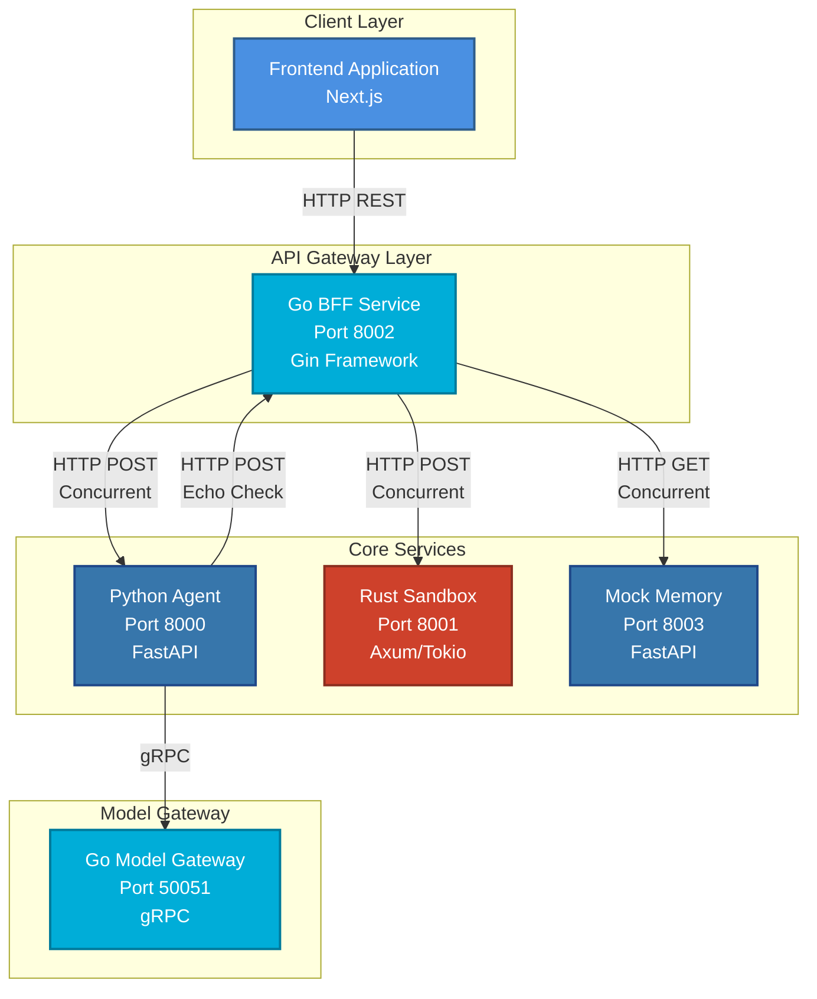
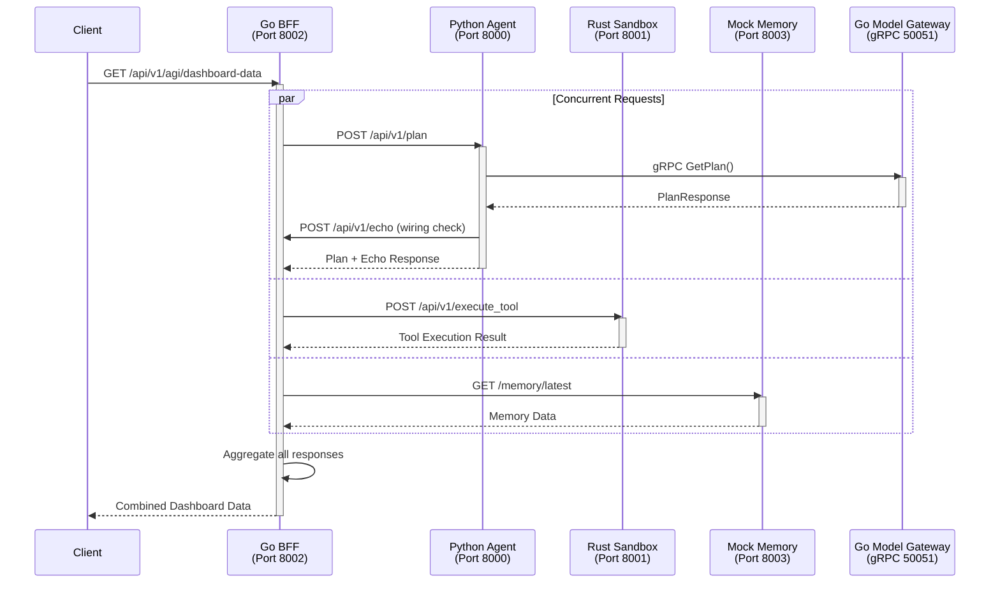
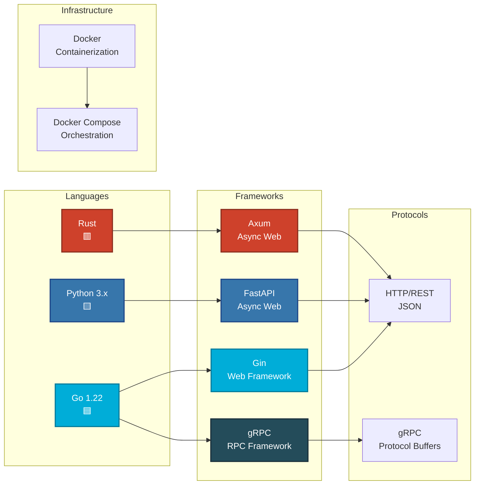
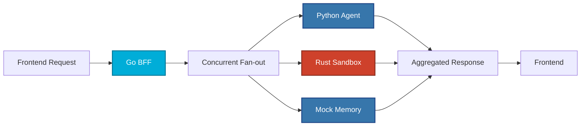
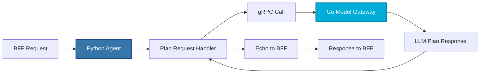
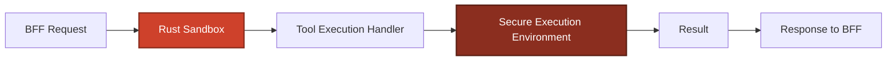
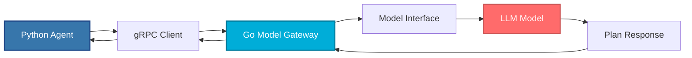

# 🚀 Polygon AGI Backend - Comprehensive Guide

> **A polyglot microservices architecture** designed for fast iteration on an "agent + tools + gateway + BFF" backend system.

---

## 📋 Table of Contents

1. [Overview](#overview)
2. [Architecture Diagram](#architecture-diagram)
3. [Services Overview](#services-overview)
4. [Request Flow](#request-flow)
5. [Technology Stack](#technology-stack)
6. [Getting Started](#getting-started)
7. [Service Details](#service-details)
8. [API Endpoints](#api-endpoints)
9. [Development Guide](#development-guide)
10. [Troubleshooting](#troubleshooting)

---

## 🎯 Overview

This backend system is built using **multiple programming languages** (polyglot architecture) to leverage the strengths of each language:

- **Go** for high-performance API gateways and BFF (Backend for Frontend)
- **Python** for AI/ML agent logic and rapid prototyping
- **Rust** for secure, sandboxed tool execution
- **gRPC** for efficient inter-service communication

The system follows a **microservices architecture** where each service has a specific responsibility and communicates with others through well-defined APIs.

---

## 🏗️ Architecture Diagram



**Legend:**
- 🔵 **Blue**: Go services (high performance)
- 🟦 **Dark Blue**: Python services (AI/ML logic)
- 🔴 **Red**: Rust service (secure execution)

---

## 📦 Services Overview

| Service | Language | Framework | Port | Purpose | Status |
|---------|----------|-----------|------|---------|--------|
| **Go BFF** | Go | Gin | 8002 | Backend for Frontend - aggregates data from all services | ✅ Active |
| **Python Agent** | Python | FastAPI | 8000 | Agent planning & orchestration, calls model gateway | ✅ Active |
| **Rust Sandbox** | Rust | Axum/Tokio | 8001 | Secure tool execution environment | ✅ Active |
| **Go Model Gateway** | Go | gRPC | 50051 | LLM model gateway (gRPC service) | ✅ Active |
| **Mock Memory** | Python | FastAPI | 8003 | Mock memory service for testing | ✅ Active |

---

## 🔄 Request Flow Diagram

### Main Dashboard Request Flow



**Key Points:**
- The BFF makes **3 concurrent requests** to improve performance
- Python Agent calls Model Gateway via **gRPC** (faster than HTTP)
- The echo call is a **non-recursive wiring check** to verify connectivity

---

## 🛠️ Technology Stack



---

## 🚀 Getting Started

### Prerequisites

Before you begin, ensure you have the following installed:

- **Python 3.8+** with `pip`
- **Go 1.22+**
- **Rust** (latest stable version)
- **Docker** and **Docker Compose** (for containerized deployment)
- **Make** (optional, for convenience commands)

### Quick Start (Docker - Recommended for Beginners)

The easiest way to get started is using Docker Compose:

```bash
# 1. Clone the repository (if not already done)
cd pagi-backend-core

# 2. Start all services
docker compose up --build

# 3. Verify services are running
curl http://localhost:8002/health
curl http://localhost:8000/health
curl http://localhost:8001/health
curl http://localhost:8003/health

# 4. Test the dashboard endpoint
curl http://localhost:8002/api/v1/agi/dashboard-data
```

**To stop all services:**
```bash
docker compose down
```

### Development Setup (Bare Metal)

For local development without Docker:

#### Step 1: Install Dependencies

**Python Services:**
```bash
# Create virtual environment
python -m venv .venv

# Activate virtual environment
# On Windows:
.venv\Scripts\activate
# On Linux/Mac:
source .venv/bin/activate

# Install Python dependencies
pip install -r backend-python-agent/requirements.txt
```

**Go Services:**
```bash
# Verify Go installation
go version

# Install Go dependencies (automatic on first run)
cd backend-go-bff && go mod download
cd ../backend-go-model-gateway && go mod download
```

**Rust Service:**
```bash
# Verify Rust installation
cargo --version

# Dependencies are managed by Cargo.toml
```

#### Step 2: Generate gRPC Stubs

```bash
# Generate Go gRPC code
make docker-generate

# Or manually:
cd backend-go-model-gateway
go generate ./...
```

#### Step 3: Run All Services

```bash
# Start all services in development mode
make run-dev

# Or manually run each service in separate terminals:
# Terminal 1: Python Agent
cd backend-python-agent
uvicorn main:app --host 127.0.0.1 --port 8000

# Terminal 2: Rust Sandbox
cd backend-rust-sandbox
cargo run

# Terminal 3: Go BFF
cd backend-go-bff
go run .

# Terminal 4: Mock Memory
cd scripts
uvicorn mock_memory_service:app --host 127.0.0.1 --port 8003

# Terminal 5: Go Model Gateway
cd backend-go-model-gateway
go run .
```

**To stop all services:**
```bash
make stop-dev
```

---

## 🔍 Service Details

### 1. Go BFF (Backend for Frontend) - Port 8002

**Purpose:** Acts as a single entry point for the frontend, aggregating data from multiple backend services.

**Key Features:**
- ✅ Concurrent request handling (fan-out pattern)
- ✅ Request ID propagation for tracing
- ✅ Structured JSON logging
- ✅ Health check endpoint

**Technology:**
- **Framework:** Gin (Go web framework)
- **Pattern:** BFF (Backend for Frontend)



**Why Go for BFF?**
- High performance and low latency
- Excellent concurrency support (goroutines)
- Efficient memory usage
- Perfect for aggregating multiple services

---

### 2. Python Agent - Port 8000

**Purpose:** Handles agent planning logic and orchestrates LLM interactions.

**Key Features:**
- ✅ Agent planning endpoint
- ✅ gRPC client for model gateway
- ✅ HTTP client for BFF communication
- ✅ Structured logging middleware

**Technology:**
- **Framework:** FastAPI (async Python web framework)
- **Communication:** HTTP REST + gRPC



**Why Python for Agent?**
- Rich AI/ML ecosystem (TensorFlow, PyTorch, etc.)
- Rapid prototyping and iteration
- Excellent libraries for NLP and AI
- Easy integration with LLM APIs

---

### 3. Rust Sandbox - Port 8001

**Purpose:** Provides a secure environment for executing tools and code safely.

**Key Features:**
- ✅ Secure code execution
- ✅ Tool execution endpoint
- ✅ Structured JSON logging
- ✅ Request ID tracking

**Technology:**
- **Framework:** Axum (async Rust web framework)
- **Runtime:** Tokio (async runtime)



**Why Rust for Sandbox?**
- Memory safety without garbage collection
- Zero-cost abstractions
- Strong security guarantees
- Perfect for sandboxed execution
- Prevents common vulnerabilities (buffer overflows, etc.)

---

### 4. Go Model Gateway - Port 50051 (gRPC)

**Purpose:** Interfaces with LLM models and provides a unified gateway for AI model interactions.

**Key Features:**
- ✅ gRPC service (high performance)
- ✅ Plan generation endpoint
- ✅ Model abstraction layer
- ✅ Latency tracking

**Technology:**
- **Framework:** gRPC (Go implementation)
- **Protocol:** Protocol Buffers



**Why gRPC?**
- **Performance:** Binary protocol (faster than JSON)
- **Type Safety:** Protocol Buffers provide strong typing
- **Streaming:** Supports bidirectional streaming
- **Efficiency:** Lower latency and bandwidth usage

**Why Go for Gateway?**
- Excellent gRPC support
- High throughput
- Low latency
- Perfect for gateway patterns

---

### 5. Mock Memory Service - Port 8003

**Purpose:** Provides mock memory storage for testing and development.

**Key Features:**
- ✅ Mock memory endpoint
- ✅ Health check
- ✅ FastAPI-based

**Technology:**
- **Framework:** FastAPI

---

## 📡 API Endpoints

### Go BFF (Port 8002)

| Method | Endpoint | Description | Request Body | Response |
|--------|----------|-------------|--------------|----------|
| `GET` | `/health` | Health check | - | `{service, status, version}` |
| `POST` | `/api/v1/echo` | Echo endpoint for wiring checks | `{ping, request_id}` | `{service, received, request_id}` |
| `GET` | `/api/v1/agi/dashboard-data` | Aggregates data from all services | - | `{service, status, request_id, data}` |

**Example Request:**
```bash
curl -X GET http://localhost:8002/api/v1/agi/dashboard-data \
  -H "X-Request-Id: test-123"
```

**Example Response:**
```json
{
  "service": "backend-go-bff",
  "status": "ok",
  "request_id": "test-123",
  "data": {
    "python_agent": {...},
    "rust_sandbox": {...},
    "memory": {...}
  }
}
```

---

### Python Agent (Port 8000)

| Method | Endpoint | Description | Request Body | Response |
|--------|----------|-------------|--------------|----------|
| `GET` | `/health` | Health check | - | `{service, status, version}` |
| `POST` | `/api/v1/plan` | Generate agent plan | `{prompt: string}` | `{service, status, plan, llm_response, bff_echo}` |

**Example Request:**
```bash
curl -X POST http://localhost:8000/api/v1/plan \
  -H "Content-Type: application/json" \
  -H "X-Request-Id: test-456" \
  -d '{"prompt": "Generate a 3-step plan to solve X"}'
```

---

### Rust Sandbox (Port 8001)

| Method | Endpoint | Description | Request Body | Response |
|--------|----------|-------------|--------------|----------|
| `GET` | `/health` | Health check | - | `{service, status, version}` |
| `POST` | `/api/v1/execute_tool` | Execute a tool | `{tool_name: string, code?: string}` | `{tool_status, result}` |

**Example Request:**
```bash
curl -X POST http://localhost:8001/api/v1/execute_tool \
  -H "Content-Type: application/json" \
  -H "X-Request-Id: test-789" \
  -d '{"tool_name": "demo"}'
```

---

### Mock Memory (Port 8003)

| Method | Endpoint | Description | Request Body | Response |
|--------|----------|-------------|--------------|----------|
| `GET` | `/health` | Health check | - | `{service, status, version}` |
| `GET` | `/memory/latest` | Get latest memory | - | Memory data |

---

## 💻 Development Guide

### Project Structure

```
pagi-backend-core/
├── backend-go-bff/          # Go BFF service
│   ├── main.go
│   ├── go.mod
│   └── Dockerfile
├── backend-python-agent/    # Python agent service
│   ├── main.py
│   ├── grpc_client.py
│   ├── requirements.txt
│   ├── proto/
│   └── Dockerfile
├── backend-rust-sandbox/    # Rust sandbox service
│   ├── src/main.rs
│   ├── Cargo.toml
│   └── Dockerfile
├── backend-go-model-gateway/ # Go gRPC model gateway
│   ├── main.go
│   ├── proto/
│   ├── go.mod
│   └── Dockerfile
├── scripts/                 # Utility scripts
│   ├── run_all_dev.py
│   └── mock_memory_service.py
├── docker-compose.yml       # Docker orchestration
├── Makefile                 # Convenience commands
└── README.md               # This file
```

### Environment Variables

Create a `.env` file (optional, defaults exist):

```bash
# Service Ports
PY_AGENT_PORT=8000
RUST_SANDBOX_PORT=8001
GO_BFF_PORT=8002
MEMORY_MOCK_PORT=8003
MODEL_GATEWAY_GRPC_PORT=50051

# Service URLs (for bare metal)
PY_AGENT_URL=http://localhost:8000
RUST_SANDBOX_URL=http://localhost:8001
GO_BFF_URL=http://localhost:8002
MEMORY_URL=http://localhost:8003
MODEL_GATEWAY_GRPC_HOST=localhost

# Timeouts
REQUEST_TIMEOUT_SECONDS=2
MODEL_GATEWAY_GRPC_TIMEOUT_SECONDS=5

# Logging
LOG_LEVEL=info
```

### Adding a New Service

1. **Create service directory:**
   ```bash
   mkdir backend-new-service
   cd backend-new-service
   ```

2. **Add to docker-compose.yml:**
   ```yaml
   pagi-new-service:
     container_name: pagi-new-service
     build:
       context: ./backend-new-service
     environment:
       - NEW_SERVICE_PORT=8004
     ports:
       - "8004:8004"
   ```

3. **Add to scripts/run_all_dev.py:**
   ```python
   {
       "name": "New Service",
       "dir": "backend-new-service",
       "cmd": ["go", "run", "."],
       "port": "8004",
       "health_url": "http://localhost:8004/health",
   }
   ```

### Debugging Tips

1. **Check service logs:**
   ```bash
   # Docker
   docker compose logs -f pagi-python-agent
   
   # Bare metal - logs are printed to stdout
   ```

2. **Test individual services:**
   ```bash
   # Health checks
   curl http://localhost:8000/health
   curl http://localhost:8001/health
   curl http://localhost:8002/health
   ```

3. **Verify gRPC connection:**
   ```bash
   # Install grpcurl
   go install github.com/fullstorydev/grpcurl/cmd/grpcurl@latest
   
   # Test gRPC endpoint
   grpcurl -plaintext localhost:50051 list
   ```

---

## 🔧 Troubleshooting

### Common Issues

#### 1. Port Already in Use

**Problem:** Service fails to start because port is already in use.

**Solution:**
```bash
# Find process using port (Windows)
netstat -ano | findstr :8000

# Kill process (Windows)
taskkill /PID <pid> /F

# Or change port in .env file
PY_AGENT_PORT=8005
```

#### 2. gRPC Stubs Missing (Bare Metal)

**Problem:** `go run .` fails with "missing gRPC stubs" error.

**Solution:**
```bash
# Generate gRPC stubs
make docker-generate

# Or manually:
cd backend-go-model-gateway
go generate ./...
```

#### 3. Service Not Responding

**Problem:** Service starts but health check fails.

**Solution:**
1. Check service logs for errors
2. Verify environment variables are set correctly
3. Ensure all dependencies are installed
4. Check firewall settings

#### 4. Docker Networking Issues

**Problem:** Services can't communicate in Docker.

**Solution:**
- Services in Docker Compose use service names (e.g., `pagi-python-agent:8000`)
- Ensure service names match in `docker-compose.yml`
- Check `depends_on` and `healthcheck` configurations

#### 5. Python Virtual Environment Issues

**Problem:** Python packages not found.

**Solution:**
```bash
# Recreate virtual environment
rm -rf .venv
python -m venv .venv
source .venv/bin/activate  # or .venv\Scripts\activate on Windows
pip install -r backend-python-agent/requirements.txt
```

---

## 📚 Learning Resources

### For Junior Developers

**Understanding Microservices:**
- [Microservices.io Patterns](https://microservices.io/patterns/index.html)
- [Martin Fowler on Microservices](https://martinfowler.com/articles/microservices.html)

**Go:**
- [Go by Example](https://gobyexample.com/)
- [Effective Go](https://go.dev/doc/effective_go)

**Python:**
- [FastAPI Documentation](https://fastapi.tiangolo.com/)
- [Python Async/Await](https://docs.python.org/3/library/asyncio.html)

**Rust:**
- [The Rust Book](https://doc.rust-lang.org/book/)
- [Axum Documentation](https://docs.rs/axum/)

**gRPC:**
- [gRPC Documentation](https://grpc.io/docs/)
- [Protocol Buffers Guide](https://developers.google.com/protocol-buffers)

---

## 🤝 Contributing

1. Create a feature branch
2. Make your changes
3. Test thoroughly
4. Submit a pull request

---

## 📝 License

[Add your license information here]

---

## 🎓 Key Concepts Explained

### What is a BFF (Backend for Frontend)?

A **BFF** is a service that sits between the frontend and multiple backend services. It:
- Aggregates data from multiple sources
- Reduces frontend complexity
- Optimizes data transfer
- Provides a single API for the frontend

### Why Polyglot Architecture?

Different languages excel at different tasks:
- **Go:** High performance, concurrency
- **Python:** AI/ML, rapid development
- **Rust:** Security, performance, memory safety

### What is gRPC?

**gRPC** is a high-performance RPC (Remote Procedure Call) framework:
- Uses Protocol Buffers (binary format)
- Faster than JSON-based REST APIs
- Supports streaming
- Strongly typed

### What is a Microservice?

A **microservice** is a small, independent service that:
- Has its own database (if needed)
- Can be deployed independently
- Communicates via APIs
- Focuses on a single business capability

---

## 📞 Support

For questions or issues:
1. Check the [Troubleshooting](#troubleshooting) section
2. Review service logs
3. Open an issue on the repository

---

**Happy Coding! 🚀**
